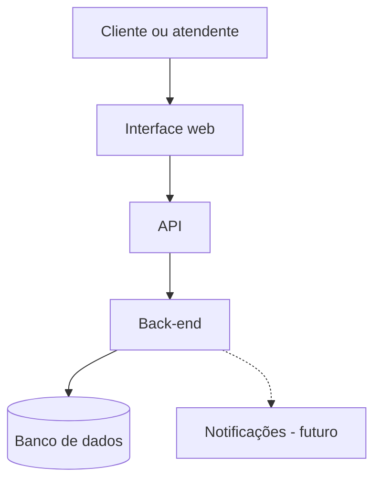

# Diagrama arquitetural — Sistema de Chamados

## Diagrama

## Explicação

A pessoa cliente ou a pessoa atendente usa a interface web. A interface envia as informações para a API. A API encaminha as solicitações para o back-end, que aplica as regras do sistema e acessa o banco de dados.

O banco de dados guarda os chamados, os clientes, os atendentes e as categorias. O serviço de notificações aparece como uma evolução futura e não será implementado na primeira versão.

| Componente | Função |
|---|---|
| Interface web | Permitir o uso do sistema pelas pessoas usuárias. |
| API | Receber e encaminhar as solicitações. |
| Back-end | Verificar os dados e aplicar as regras do sistema. |
| Banco de dados | Armazenar as informações dos chamados. |
| Notificações — futuro | Enviar avisos sobre alterações nos chamados. |
