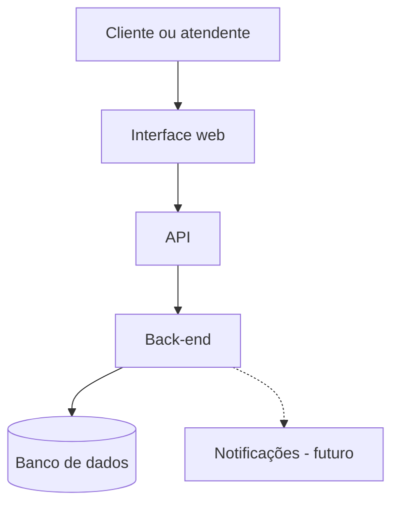

# Atividade Prática — Planejamento Inicial de um Sistema de Chamados

## 1. Descrição do problema e do domínio

A empresa de suporte técnico recebe solicitações por planilhas e mensagens. Com isso, fica difícil encontrar os chamados, saber o que já foi atendido e acompanhar o andamento de cada pedido.

A proposta é criar um sistema web para organizar os chamados de suporte técnico. Nele, a pessoa cliente poderá registrar e acompanhar uma solicitação, e a pessoa atendente poderá consultar, atualizar e encerrar os chamados.

## 2. Escopo inicial

A primeira versão do sistema terá as seguintes funções:

- cadastrar um chamado;
- consultar chamados;
- visualizar os detalhes de um chamado;
- atualizar o status do chamado;
- encerrar um chamado resolvido.

A primeira versão não terá notificações, anexos ou relatórios.

Como evolução futura, o sistema poderá enviar **notificações automáticas** quando um chamado for criado, atualizado ou encerrado.

## 3. Pessoas usuárias e seus objetivos

| Pessoa usuária | Objetivo |
|---|---|
| Pessoa cliente | Registrar um chamado e acompanhar seu andamento. |
| Pessoa atendente | Consultar, atender, atualizar e encerrar chamados. |

## 4. Requisitos funcionais iniciais

1. O sistema deve permitir que uma pessoa cliente registre um chamado com título, descrição e categoria.
2. O sistema deve permitir que uma pessoa cliente consulte seus próprios chamados.
3. O sistema deve permitir que uma pessoa atendente consulte os chamados cadastrados.
4. O sistema deve permitir que uma pessoa atendente altere o status de um chamado.
5. O sistema deve permitir que uma pessoa atendente encerre um chamado resolvido.

## 5. Recursos principais do sistema

| Recurso | Informações principais |
|---|---|
| Chamado | Código, título, descrição, status, data de abertura e data de encerramento. |
| Cliente | Código, nome e contato. |
| Atendente | Código, nome e contato profissional. |
| Categoria | Código e nome da categoria. |

Os principais status do chamado serão **Aberto**, **Em atendimento** e **Encerrado**.

## 6. Fluxo de uso prioritário: registrar um chamado

1. A pessoa cliente acessa a tela de novo chamado.
2. A pessoa informa o título, a descrição e a categoria.
3. A interface envia os dados para a API.
4. O back-end verifica se os dados estão preenchidos corretamente.
5. O back-end cria o chamado com o status “Aberto”.
6. O banco de dados armazena o chamado.
7. A aplicação mostra uma mensagem confirmando o registro.

## 7. Diagrama arquitetural simplificado



A interface web recebe as informações das pessoas usuárias. A API encaminha as solicitações. O back-end aplica as regras do sistema e conversa com o banco de dados. O banco de dados armazena os chamados. O serviço de notificações é uma possibilidade futura e não faz parte da primeira versão.

## 8. Organização inicial do repositório

```text
projeto-chamados/
├── README.md
├── docs/
│   ├── planejamento-semana-1.md
│   └── diagrama-arquitetura.md
├── frontend/
├── backend/
└── database/
```

- `README.md`: apresenta o projeto e os integrantes.
- `docs/`: guarda os documentos da atividade.
- `frontend/`: será usado para a interface web.
- `backend/`: será usado para a API e as regras do sistema.
- `database/`: será usado para os arquivos do banco de dados.

## 9. Decisões e dúvidas da equipe

### Decisões

- A primeira versão terá somente as funções básicas de chamados.
- Os perfis serão pessoa cliente e pessoa atendente.
- Um chamado novo começará com o status “Aberto”.
- As notificações ficarão para uma versão futura.

### Dúvidas em aberto

- A pessoa cliente poderá reabrir um chamado encerrado?
- Quais categorias de chamado serão usadas?
- A pessoa atendente verá todos os chamados ou apenas os chamados atribuídos a ela?

## Checklist

- [x] Problema e domínio descritos.
- [x] Escopo inicial definido.
- [x] Evolução futura indicada.
- [x] Pessoas usuárias e objetivos informados.
- [x] Requisitos funcionais listados.
- [x] Recursos principais listados.
- [x] Fluxo prioritário descrito.
- [x] Diagrama arquitetural incluído.
- [x] Organização inicial do repositório apresentada.
- [x] Decisões e dúvidas registradas.
